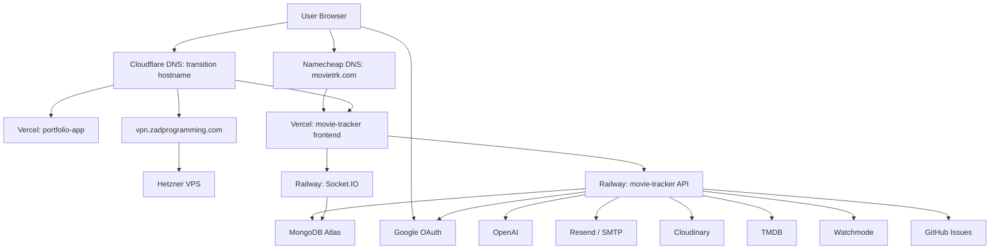

# Movie Tracker Production Architecture

Last reviewed: 2026-08-21

Related documents:

- [DEPLOYMENT.md](./DEPLOYMENT.md)
- [DNS.md](./DNS.md)
- [INFRASTRUCTURE_RECOVERY.md](./INFRASTRUCTURE_RECOVERY.md)

## Summary

Movie Tracker is split across specialized providers. The canonical frontend is migrating to `movietrk.com`; the old hostname remains a parallel production entry point during verification.

| Layer | Provider | Responsibility |
|---|---|---|
| Canonical DNS | Namecheap BasicDNS | Authoritative DNS for `movietrk.com` |
| Transition DNS | Cloudflare | Authoritative DNS for `zadprogramming.com` |
| Portfolio frontend | Vercel | Hosts `portfolio.zadprogramming.com` |
| Movie Tracker frontend | Vercel | Hosts canonical `movietrk.com`, redirects `www`, and retains the old hostname |
| Movie Tracker backend/API | Railway | Hosts API and Socket.IO service |
| Database | MongoDB Atlas | Stores Movie Tracker application data |
| VPN | Hetzner VPS | Hosts only `vpn.zadprogramming.com` |
| Email | Resend, SMTP, Amazon SES DNS | Sends and authenticates outbound mail |

Sensitive values are intentionally omitted. Use placeholders such as `<RAILWAY_BACKEND_URL>`, `<MONGODB_URI>`, `<JWT_SECRET>`, and `<OPENAI_API_KEY>` when documenting examples.

## Architecture Diagram

## Component Responsibilities

| Component | Responsibility | Notes |
|---|---|---|
| Namecheap BasicDNS | Routes `movietrk.com` and `www.movietrk.com` to Vercel | Canonical DNS authority |
| Cloudflare DNS | Routes the old Movie Tracker hostname and other `zadprogramming.com` services | Retained during migration |
| Vercel `portfolio-app` | Builds and serves the portfolio frontend | Uses `portfolio.zadprogramming.com` |
| Vercel `movie-tracker` | Builds and serves the Movie Tracker frontend | Canonical `movietrk.com`; `www` redirects; old hostname retained temporarily |
| Railway `movie-tracker` | Runs backend API and Socket.IO server | Uses Railway-generated public backend URL |
| MongoDB Atlas | Stores users, movies, watchlists, groups, and app data | Accessed through `MONGODB_URI` |
| Google OAuth | User sign-in provider | Client IDs only are public; secrets must stay out of docs |
| Resend / SMTP | Sends bug reports and app emails | DNS includes SPF, DKIM, DMARC support |
| Cloudinary | Image/media hosting | API secret must remain private |
| OpenAI | AI-powered backend features | API key must remain private |
| TMDB / Watchmode | Movie metadata and release data | API keys must remain private |
| Hetzner VPS | VPN only | Must not host `portfolio`, `movietracker`, `@`, or `www` records |

## Deployment Flow

1. Backend code changes are deployed to Railway from the repository server directory.
2. Railway builds the backend, starts it with the configured start command, and exposes `<RAILWAY_BACKEND_URL>`.
3. Vercel builds the Movie Tracker frontend from the client directory.
4. Vercel frontend environment variables point API and Socket.IO traffic to `<RAILWAY_BACKEND_URL>`.
5. Namecheap DNS sends `movietrk.com` to Vercel; Cloudflare continues sending the old hostname to the same project.
6. Browser traffic loads the frontend from Vercel, then calls Railway for API and Socket.IO.

Portfolio deployments are separate: Vercel builds the portfolio project and Cloudflare routes `portfolio.zadprogramming.com` to that Vercel project.

## Request Flow

| Step | Flow |
|---|---|
| 1 | User opens `https://movietrk.com` |
| 2 | Namecheap DNS resolves the hostname to Vercel |
| 3 | Vercel serves the static frontend |
| 4 | Frontend reads `REACT_APP_API_BASE_URL` and calls `<RAILWAY_BACKEND_URL>` |
| 5 | Railway backend handles API request |
| 6 | Backend reads/writes MongoDB Atlas through `MONGODB_URI` |
| 7 | Backend returns JSON to the frontend |

## Authentication Flow

| Step | Flow |
|---|---|
| 1 | User initiates sign-in from the Vercel frontend |
| 2 | Frontend uses Google OAuth client configuration |
| 3 | Authentication result is sent to the Railway backend |
| 4 | Backend validates identity and issues/validates app session tokens |
| 5 | JWT/session configuration is controlled by `JWT_SECRET` and related auth variables |

Never document OAuth secrets, JWT secrets, refresh tokens, or provider credentials.

## Socket.IO Flow

| Step | Flow |
|---|---|
| 1 | Frontend reads `REACT_APP_SOCKET_URL` |
| 2 | Browser connects to Railway Socket.IO endpoint at `<RAILWAY_BACKEND_URL>` |
| 3 | Railway service handles realtime events |
| 4 | Socket handlers may read/write MongoDB Atlas |
| 5 | Events are emitted back to connected clients |

Socket.IO uses the Railway backend service, not a Cloudflare custom backend hostname.

## Database Interactions

MongoDB Atlas is accessed only by the Railway backend. Frontend clients must not connect directly to MongoDB.

| Data category | Access path |
|---|---|
| Users/auth state | Vercel frontend -> Railway API -> MongoDB Atlas |
| Watchlists/groups | Vercel frontend -> Railway API -> MongoDB Atlas |
| App settings/preferences | Vercel frontend -> Railway API -> MongoDB Atlas |
| Realtime updates | Vercel frontend -> Railway Socket.IO -> MongoDB Atlas as needed |

## Email Flow

| Step | Flow |
|---|---|
| 1 | App triggers an email event in the Railway backend |
| 2 | Backend uses Resend and/or SMTP variables |
| 3 | Provider sends mail using configured sender identity |
| 4 | Cloudflare DNS records authenticate mail through SPF, DKIM, and DMARC |

Email-related variable names include `RESEND_API_KEY`, `EMAIL_FROM`, and `SMTP_*`. Values must remain secret.

## AI Integrations

AI-related backend features should run on Railway, never in browser-only code with private keys.

| Integration | Expected location | Variable names |
|---|---|---|
| OpenAI | Railway backend | `OPENAI_API_KEY` |
| Movie metadata | Railway backend and/or Vercel frontend depending on key exposure | `TMDB_API_KEY`, `WATCHMODE_API_KEY`, `WATCHMODE_REGION` |

## Third-Party Services

| Service | Used by | Purpose | Secret handling |
|---|---|---|---|
| MongoDB Atlas | Railway backend | Database | Keep `MONGODB_URI` secret |
| Google OAuth | Frontend and backend | Authentication | Client ID may be public; secrets must remain private |
| Resend | Railway backend | Email delivery | Keep API key secret |
| SMTP provider | Railway backend | Email fallback/delivery | Keep credentials secret |
| Amazon SES DNS | Cloudflare DNS | Mail authentication/feedback MX | DNS records are public |
| Cloudinary | Railway backend | Media storage | Keep API secret private |
| OpenAI | Railway backend | AI features | Keep API key secret |
| TMDB | App/frontend/backend | Movie metadata | Treat API keys as sensitive |
| Watchmode | Backend | Release/availability data | Treat API keys as sensitive |
| GitHub | Railway backend | Bug issue automation | Keep token secret |

## Known Operational Notes

| Area | Note |
|---|---|
| DNS | `portfolio`, `movietracker`, and apex must not point to the Hetzner VPN IP |
| Railway | Backend uses Railway-generated domain unless a dedicated API subdomain is intentionally added |
| Vercel | Custom domains are attached to their respective Vercel projects |
| CORS | Railway backend must allow the apex, `www`, and old hostname during transition |

