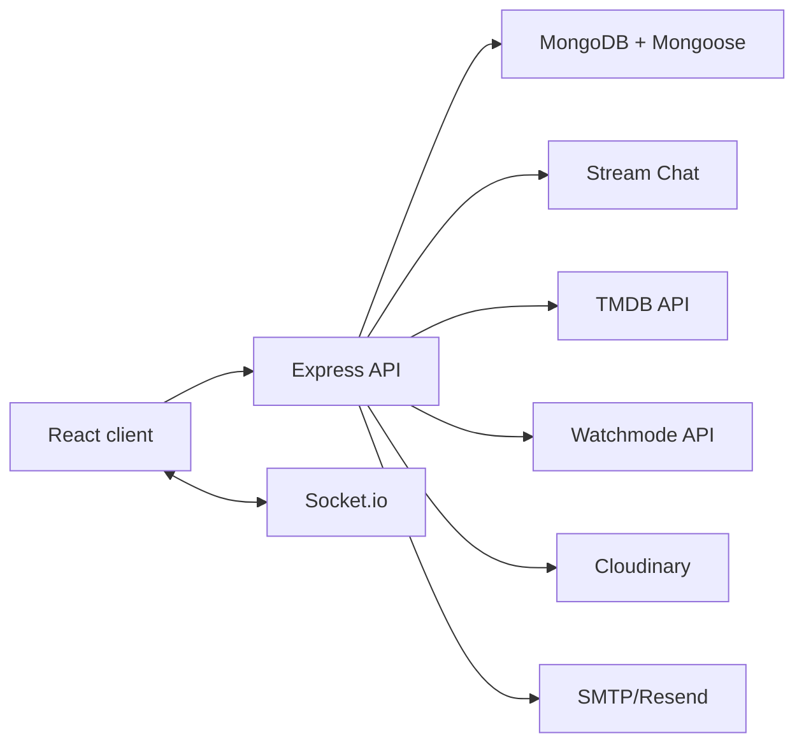

# Movie Tracker

Movie Tracker is a full-stack social movie-night app for groups that want one shared place to plan what to watch, vote on options, track watched movies, and keep the conversation around each group.

Live app: https://movie-tracker-cyan-six.vercel.app

## What it demonstrates

- **Group movie planning:** Users can create groups, invite friends, manage memberships, and keep movie activity scoped to each group.
- **Collaborative polls:** Groups can suggest movie options, vote, and resolve winners with app-level voting rules.
- **Shared watchlist and watch history:** Groups can add movies, mark titles as watched, and keep richer watch context for later.
- **Realtime group chat:** Stream Chat and Socket.io support private group conversations, unread counts, and navbar chat access.
- **Authentication and profiles:** JWT auth, Google sign-in support, protected routes, user profiles, avatars, and favorite groups.
- **Movie discovery:** TMDB-backed search/details plus coming-soon enrichment paths using TMDB and optional Watchmode data.
- **Operational feedback loop:** Optional bug report flow can create GitHub issues and email notifications when configured.

## Architecture



## Tech Stack

| Layer | Technology |
| --- | --- |
| Frontend | React 18, TypeScript/JavaScript, React Router, Zustand, MUI, custom CSS |
| Backend | Node.js, Express, TypeScript, Mongoose |
| Realtime | Socket.io, Stream Chat |
| Auth | JWT, Google OAuth |
| Media/data | TMDB, Watchmode, Cloudinary |
| Testing | Playwright end-to-end tests |
| Deployment | Vercel frontend with separate backend service |

## Repository layout

```text
movie-tracker/
  client/          React app, UI components, stores, API clients
  server/          Express API, routes, models, middleware, realtime socket setup
  tests/e2e/       Playwright end-to-end specs and helpers
  Docs/            Planning notes and feature references
```

## Local setup

Prerequisites:

- Node.js 20+
- MongoDB connection string
- TMDB API key
- Stream Chat credentials for group chat

```bash
git clone https://github.com/ZadBabaei/movie-tracker.git
cd movie-tracker

copy server\.env.example server\.env
copy client\.env.example client\.env
```

Fill in the required values in `server/.env` and `client/.env`, then run:

```bash
cd server
npm ci
npm run build
npm run dev
```

In a second terminal:

```bash
cd client
npm ci
npm start
```

The client uses the CRA proxy in local development when `REACT_APP_API_BASE_URL` is empty.

## Validation

```bash
cd server
npm ci
npm run build

cd ../client
npm ci
npm run build

cd ..
npm ci
npm run e2e
```

The Playwright suite expects a reachable app and test database configuration. See `tests/e2e/README.md` for details.

## Environment

Use the example files as the source of truth:

- `server/.env.example` for database, auth, Stream Chat, TMDB/Watchmode, Cloudinary, email, and bug-report integrations.
- `client/.env.example` for frontend API URLs, Google OAuth, TMDB, and feature flags.

Do not commit real `.env` files.


<!-- add-to-portfolio -->

## License

MIT
